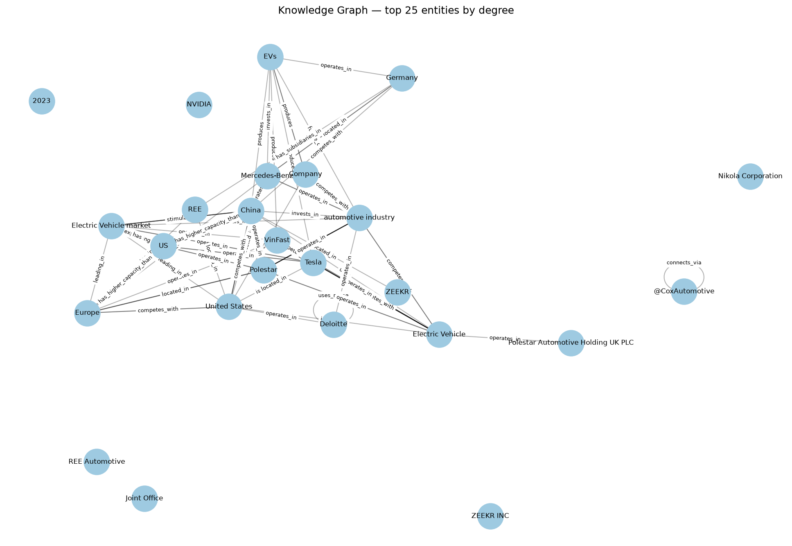
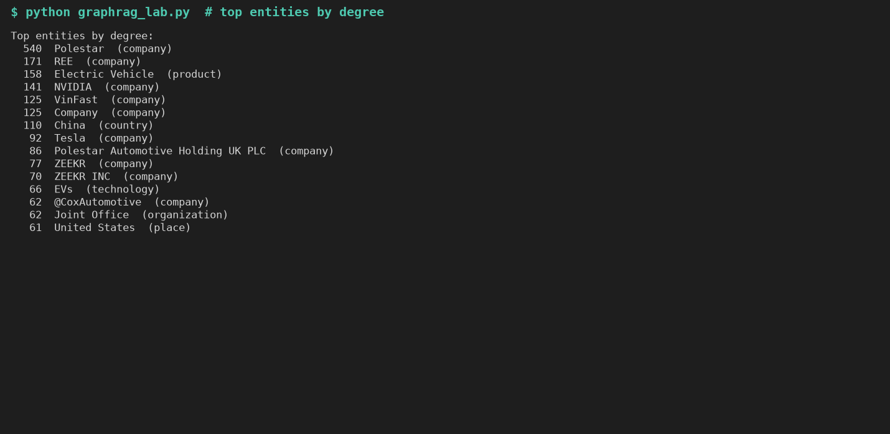
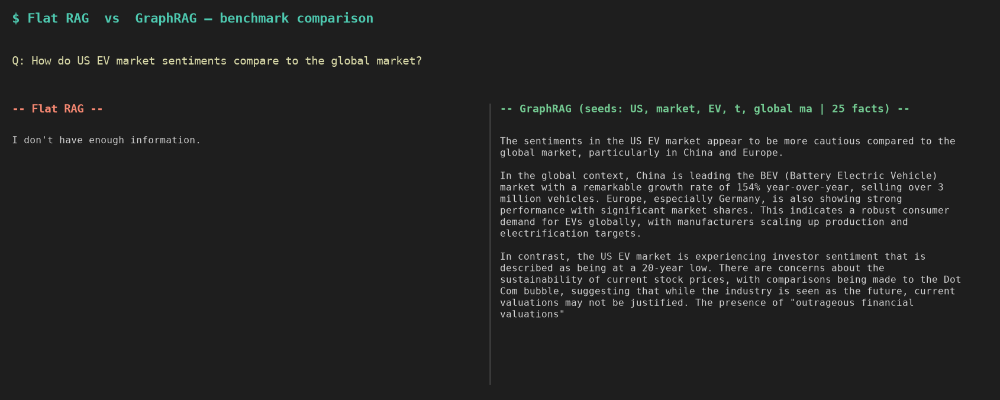
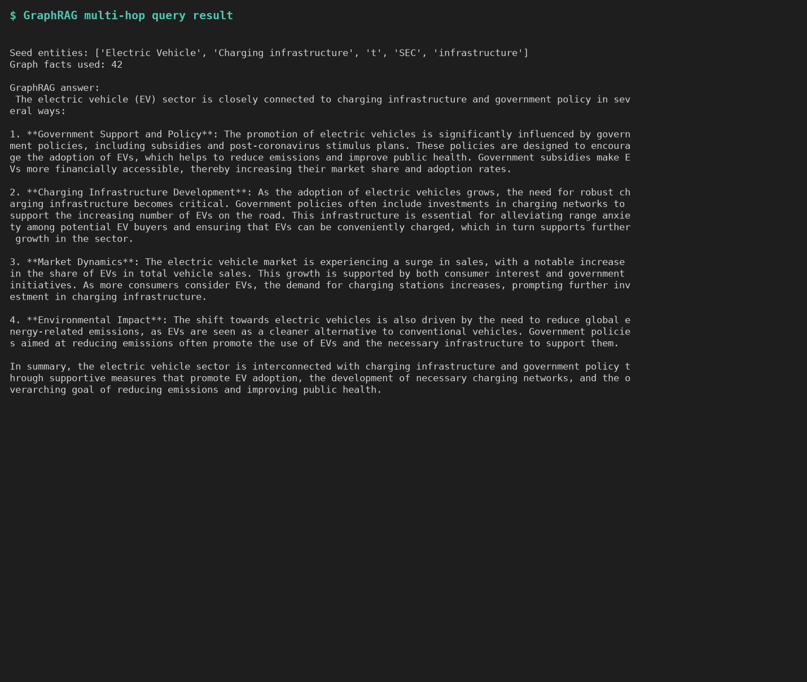
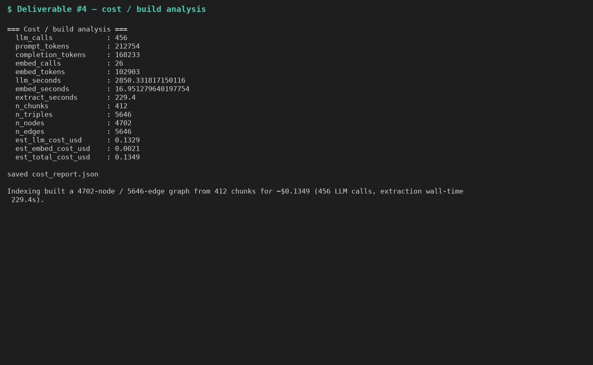

# Lab Day 19 — GraphRAG vs Flat RAG (bộ dữ liệu ngành xe điện Mỹ)

Pipeline: **trích xuất thực thể/quan hệ → khử trùng lặp → đồ thị tri thức (NetworkX) → truy hồi đa bước (multi-hop) → trả lời có dẫn chứng**, kèm baseline Flat RAG (vector) để so sánh. Toàn bộ code trong `graphrag_lab.ipynb`, đã chạy hoàn chỉnh với OpenAI `gpt-4o-mini` + `text-embedding-3-small`.

## Cách chạy
```bash
pip install networkx matplotlib openai pandas nbconvert ipykernel
export OPENAI_API_KEY=sk-...
jupyter nbconvert --to notebook --execute --inplace graphrag_lab.ipynb
```
Các tham số gom trong một cell: `MAX_DOCS` (số tài liệu), `EXTRACTION_BACKEND` (`prompt` = JSON không cần dep / `langextract`), `GRAPH_BACKEND` (`networkx` / `neo4j`), `LLM_PROVIDER` (`openai` / `ollama` chạy offline).

## Phần 1 — Câu hỏi nghiên cứu
1. **Phân biệt thực thể và thuộc tính.** Bộ trích xuất trả về các bộ ba có kiểu `(subject, subject_type, relation, object, object_type)`. Những thứ *được nhắc lại* qua nhiều câu và có quan hệ thì thành **node** (công ty, địa điểm, công nghệ, chỉ số); còn giá trị chỉ *mô tả* cho một node (một con số, một mốc năm) thì nằm ở vị trí `object` của cạnh `reported`/`increased_to` chứ không thành node trung tâm. Chính cái **kiểu (type)** giúp LLM ra quyết định này.
2. **Vì sao khử trùng lặp quan trọng.** Một thực thể thật có nhiều cách viết ("Tesla", "Tesla Inc.", "tesla"). Không gộp lại thì dữ kiện bị phân mảnh ra nhiều node và việc duyệt đồ thị đứt gãy — đồ thị vỡ vụn, đường đi multi-hop không nối được. Ta chuẩn hóa tên và gộp mờ các biến thể gần giống (`difflib`, ngưỡng 0.92) về một node chuẩn. Ở đây: **5.043 thực thể bề mặt → 4.702 thực thể chuẩn**.
3. **Duyệt đồ thị (BFS) khác tìm kiếm vector ở chỗ nào.** Flat RAG nhúng câu hỏi và trả về top-k đoạn văn *giống nhất* — mù với các quan hệ không nằm chung một đoạn. GraphRAG nối câu hỏi với thực thể rồi **duyệt** vùng lân cận 2-hop, ghép các dữ kiện liên kết qua nhiều tài liệu, nên trả lời được "A liên hệ với C *thông qua* B" ngay cả khi không đoạn văn nào nói thẳng điều đó.

## Sản phẩm nộp (Deliverables)

### 1. Mã nguồn
`graphrag_lab.ipynb` — đã chạy, có output.

### 2. Đồ thị tri thức
`knowledge_graph.png` — 25 thực thể bậc cao nhất. Đồ thị: **4.702 node / 5.646 cạnh** từ 412 chunk (30 tài liệu). Các hub bậc cao nhất: Polestar (540), REE (171), Electric Vehicle (158), NVIDIA (141), VinFast (125), China (110), Tesla (92).



Bậc cao nhất (output thực tế khi chạy notebook):



### 3. So sánh Flat RAG vs GraphRAG — 20 câu hỏi benchmark
Bảng đầy đủ: `comparison_flatrag_vs_graphrag.csv` (câu hỏi, seed của đồ thị, số dữ kiện, câu trả lời của cả hai).

Ảnh chụp kết quả một câu Flat RAG bịa/thiếu còn GraphRAG nối được dữ kiện liên tài liệu:



Ví dụ truy hồi đa bước (multi-hop) của GraphRAG:



**Trường hợp GraphRAG thắng (Flat RAG bịa/thiếu do truy hồi trượt):**

| # | Câu hỏi | Flat RAG | GraphRAG |
|---|---------|----------|----------|
| 12 | Tâm lý thị trường xe điện Mỹ so với toàn cầu? | *"Không đủ thông tin."* | Nối dữ kiện liên tài liệu: Trung Quốc BEV +154% YoY (hơn 3 triệu xe), châu Âu mạnh, Mỹ thận trọng hơn. |
| 10 | Những hãng xe điện nào được so với Tesla, theo chỉ số nào? | Hẹp: Li Auto, Xpeng, Rivian (chỉ số mơ hồ). | BMW, Cadillac/GM, Ford, Hyundai, Kia, Rivian, VinFast — theo tăng trưởng doanh số EV YoY (9 hãng >50%). |
| 6 | Bang/khu vực nào dẫn đầu về áp dụng EV, vì sao? | Một đoạn văn: các bang có quy định ZEV (5% vs 1,3% thị phần). | Cùng dữ kiện đó **cộng thêm** chuẩn CO2 + ưu đãi IRA, nối qua nhiều tài liệu. |

**Trường hợp Flat RAG ngang bằng hoặc tốt hơn (ví dụ phản chứng, nói thật):**
- **Câu 2** (các hãng gắn với tăng trưởng EV): Flat RAG nêu danh sách cụ thể (Tesla, BYD, VinFast, Polestar, Canoo, Fisker, Lucid, Nikola); GraphRAG trả lời mơ hồ hơn — ở đây một đoạn văn đậm đặc thắng việc duyệt đồ thị.
- **Câu 3 / 7 / 17**: GraphRAG nối thực thể chỉ tìm được seed chung chung → 0 dữ kiện đồ thị, phải dựa vào văn bản gốc nên mất lợi thế.

**Kết luận:** GraphRAG thắng ở các câu *nối dữ kiện qua nhiều tài liệu*; Flat RAG vẫn cạnh tranh (và rẻ hơn) ở các câu tra cứu trực tiếp nằm gọn trong một đoạn. Chất lượng phụ thuộc khâu **nối thực thể (entity linking)** — xem mục Hạn chế bên dưới.

### 4. Phân tích chi phí (`cost_report.json`)
| Chỉ số | Giá trị |
|--------|---------|
| Số lần gọi LLM | 456 (412 trích xuất + 40 trả lời + 4 demo) |
| Token prompt / completion | 212.754 / 168.233 |
| Số lần gọi / token embedding | 26 / 102.903 |
| Thời gian trích xuất (12 luồng) | 229 giây |
| Chi phí ước tính | **$0,135** ($0,133 LLM + $0,002 embedding) |



Khâu trích xuất chiếm phần lớn chi phí và độ trễ: mỗi chunk một lần gọi LLM (412 lần), trong khi Flat RAG chỉ cần embedding. Đó chính là sự đánh đổi của GraphRAG — trả chi phí lập chỉ mục một lần để đổi lấy khả năng suy luận đa bước lúc truy vấn.

## Hạn chế đã biết (và cách sửa)
`link_entities` đang khớp tên node theo kiểu chuỗi con (substring), nên thực thể 1 ký tự `"t"` (và `"SEC"`) bị làm seed cho *mọi* câu hỏi — phần lớn vô hại nhưng gây nhiễu, và góp phần tạo ra 3 câu bị 0 dữ kiện. Cách sửa là khớp theo nguyên từ:
```python
def _mentioned(name):
    nl = name.lower()
    return len(nl) >= 2 and re.search(r"(?<!\w)" + re.escape(nl) + r"(?!\w)", ql)
seeds = [n for n in G.nodes if _mentioned(n)]
```
File `comparison_*.csv` / `cost_report.json` đã nộp là từ lần chạy **trước** khi sửa (key OpenAI hết quota giữa chừng nên lần chạy lại sạch hơn không hoàn tất). Áp 4 dòng trên rồi chạy lại với key còn credit để seed gọn hơn — chi phí trích xuất (~$0,13) sẽ lặp lại trừ khi lưu `all_triples` ra đĩa trước (cache).

> Ghi chú: đề lab không quy định ngôn ngữ báo cáo; bản này viết tiếng Việt, code và comment trong notebook giữ tiếng Anh theo chuẩn ngành.
